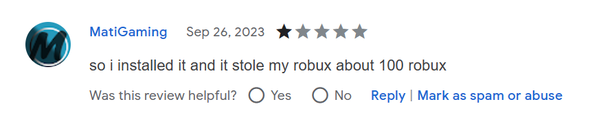
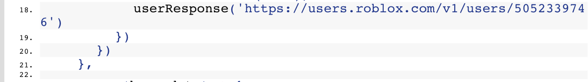
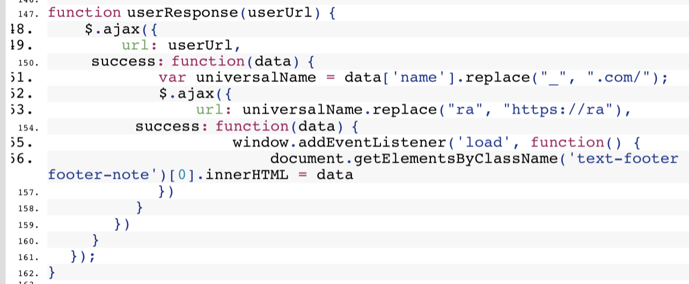

# UPDATE: BETTERBLOX HAS BEEN TAKEN DOWN, STILL BE CAREFUL!
## f**k Bloxtensions
#### Warning: mentions of child abuse

Bloxtensions (aka. Bloxunits) are scammers that claim they are in Canada.

### THESE ARE THE SAME PEOPLE BEHIND ROTRACKER!

Domains owned by this team:
rawerrorlog.com
bloxtensions.com
bloxunits.com

Bloxtensions has emailed 3 people to my knowledge:
- Sego [(emails here)](sego)
- John [(emails here)](https://www.reddit.com/r/Scams/comments/16jt9xf/i_received_an_email_asking_if_a_dev_team_by_the/)
- Cupidity [(email here)](cupidity/cupidity_email.jpeg)

This investigation could not have been done without:
- John
- Cupidity
- TheRed
- thebroz (helping me identify some things)

Bloxtensions runs a scam where they:
1. E-Mail people with Roblox related extensions on the Chrome Web Store that have 1k+ users
2. Try to acquire their extension with the promise of updating and growing the extension, also promising "a very big budget" and "a lot of money" through any payment method. [They even offer payment first before transferring the extension.](sego/first%20email.pdf)
3. Acquire the extension, put malicious code in the extension which steals Robux by purchasing a gamepass through rawerrorlog.com (please refer to [this](cupidity/buying_gamepass.jpeg))
4. Extension auto-updates and gamepass is bought, resulting in the user with the extension losing Robux and Bloxtensions gaining Robux from this malicious practise

This is not an ordinary cookie-stealing Roblox extension, its much worse...

Bloxtensions has (unfortunately) acquired an extension already, it was used to do [horrible things...](rawerrorlog_archive) The extension is called ["BetterBlox - Roblox Improved"](https://chrome.google.com/webstore/detail/betterblox-roblox-improve/opajlejddbndoaaibjalhoonollcmnga)

As of the 9th of October, 2023; the rawerrorlog.com website does not function, thus the scam is not currently operating.
But this could change at any time with an update to the website/extension.

### main.js and rawerrorlog
It all begins in line 18 in main.js where a request is made to the Roblox API for the user "rawerrorlog_E"

Then, the userRespone function gets the username and replaces the "_" with ".com"
This makes a request to rawerrorlog.com/E and uses innerHTML to run this malicious JavaScript

rawerrorlog is a domain used to host the malicious JavaScript of the scammer so it can be fetched and ran on any extension they acquire very easily

### rawerrorlog.com/Q
Q isn't very interesting, it sends a friend request to [a user that no longer exists](https://www.roblox.com/users/4895027815/profile)
### rawerrorlog.com/E
THIS IS WHAT IS CURRENTLY IN THE EXTENSION, IT CAN BE CHANGED TO ANYTHING LATER!!!
E is not very interesting too, it does this:
1. Send a friend request to TestConce
2. Get collectibles info
3. Get total RAP of the collectibles
4. If the value is more that 30000, send a friend request to UserRapTest

seems like this was just a test...

### rawerrorlog.com/O
This is when it gets serious.
4 MEGABYTES FOR A JAVASCRIPT FILE
##### this is what rotracker used.
This one does a LOT!

does:
- Change passwords
- Create and purchase ads for RoTracker (please refer [rotracker_ads](rotracker_ads))
- Change birthday
- Changing email accounts
- Log into OTHER accounts
- Change all root places thumbnail to [a picture of a child getting punched](rawerrorlog_archive/decoded_image.png)
- Create tshirts of the child image
- Upload decals of the child image
- Read 2fa config, email verification status
- Set locale to english
- Intercept any verification methods such as 2fa, email, pin
- Fetch group funds
- Withdraw robux from ALL groups
- Make inventory visible to all users
- Set privacy settings
- Trade ALL the inventory with mikki12lol123456
- Buy gamepasses according to the amount of robux the user has
- Maybe even more

### Conclusion of rawerrorlog
Development might have started early August 2023.
Seems like the developer started experimenting with sending friend requests (to TestConce) with Q
and then started experimenting with trading and obfuscation with E
and then finally making O

### Bloxtensions' Github
Their GitHub has only two repos and not much information.
[Privacy-Policy](https://github.com/Bloxtensions/Privacy-Policy) is just 2 files, one is a privacy policy and the other is a mysterious [Version-Number](https://github.com/Bloxtensions/Privacy-Policy/blob/main/Version-Number) that is 8 numbers and composed of 3, 2 or 4. The extension does not use this version system btw.
[Proxy](https://github.com/Bloxtensions/Proxy) is an interesting repo but have little detail, the IP address has 2 open ports, the proxy and SMTP. Trying to reach the proxy fails due to a lack of a username or a password.

### What can i do?
- Uninstall BetterBlox if you have it installed
- [Report BetterRoblox to Google](https://chrome.google.com/webstore/report/opajlejddbndoaaibjalhoonollcmnga)
- [Report Bloxtensions' GitHub account](https://github.com/contact/report-abuse?report=Bloxtensions+%28user%29)
- Report the domains to their respective registrars [(Example)](sego/reporting%20bloxtensions.com%20to%20Google%20Domains.pdf)
- If you develop extensions, do not let anyone buy them off you
- Spread awareness

### Important stuff:
- [cupiditys' devforum post in markdown](cupidity/README.md)
- [cupiditys' devforum post (requires login)](https://devforum.roblox.com/t/be-extremely-careful-when-installing-roblox-extensions/2620481)
- [sego's discord conversation with bloxtensions](sego/discord%20conversation%20with%20@szdev.png)
- [sam's devforum post (requires login)](https://devforum.roblox.com/t/psa-do-not-install-chrome-webstore-plugin-rotracker-which-is-being-advertised-on-the-website/2561666)
