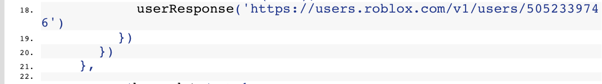

on September 27th, 2023 cupiditys wrote:

About 2 weeks ago I was contacted by a group named “Bloxtensions” who offered me whatever amount of money I wanted for my chrome extension “BetterBlox” which has around 1.5k users I believe.

I asked for $1000 which seemed fair for an extension I didn’t even do anything with anymore. They agreed to this amount which was nice for me, and after they sent the money I transferred ownership. Going back to this extension now, it was updated 3 days ago to include malicious code that drains the user’s robux amount by purchasing gamepasses.

It makes a request to a roblox account named “rawerrorlog_E” which the name is transformed to a url which includes the malicious code

I would have never sold this extension if I knew it would be used for this. My name is still plastered all over and there is even old reviews saying it’s safe which could trick others. It may have been naive but I really did not expect this at all for some reason

Looking at the code further, it seems like the game pass buying “function” has not been activated yet but it would be once the rawerrorlog account sets it’s description to a user id. If their website or the extension gets removed before they activate it then people would not lose their money. I will try to contact chrome web store but I’m not sure if it would do anything